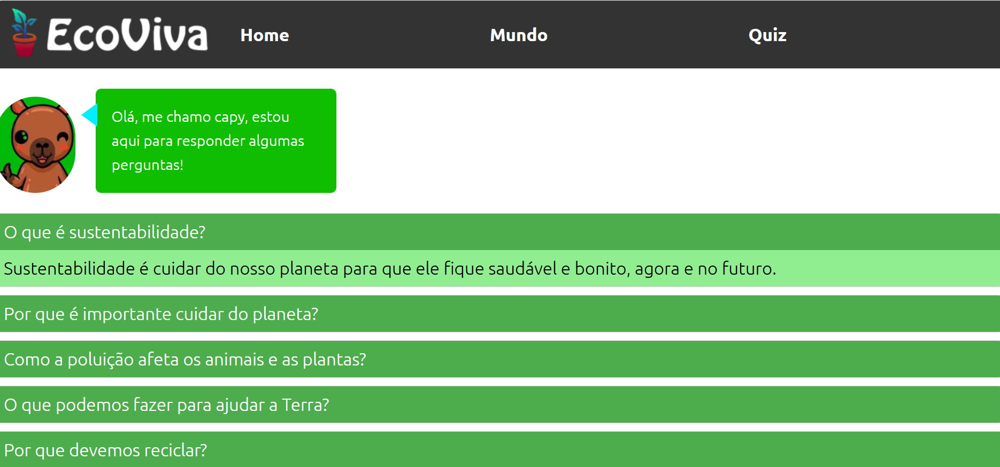
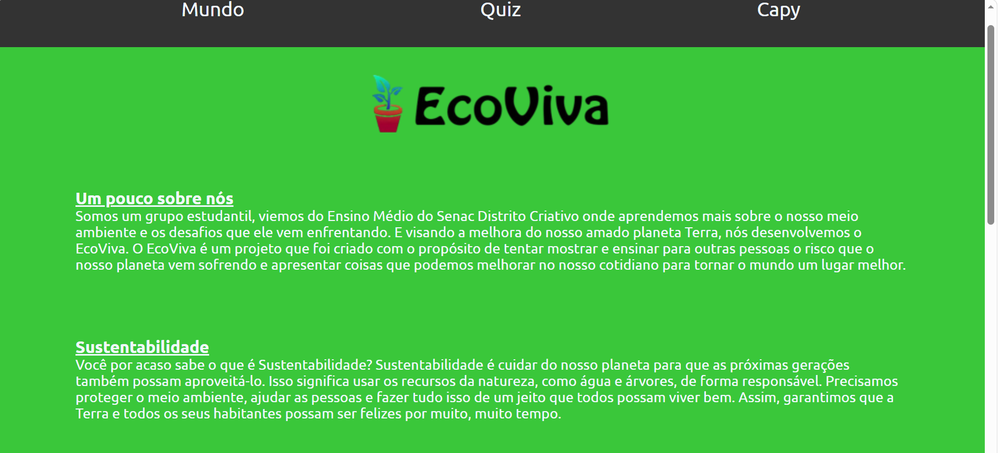
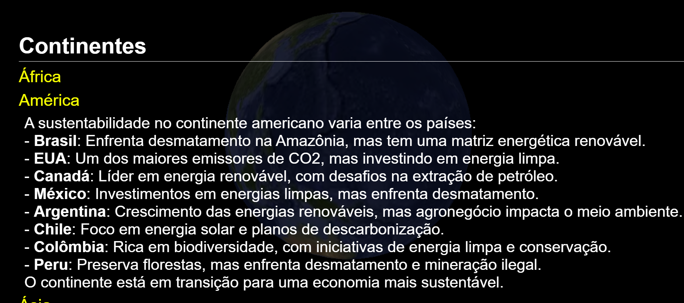
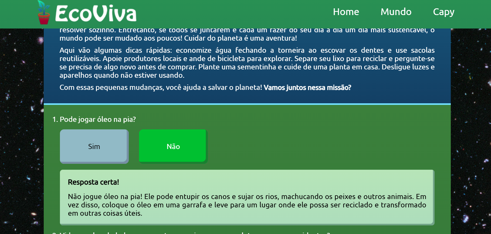

# EcoViva

### ♻️ Tema do Projeto
Compreensão e conscientização sobre temas relacionados à **sustentabilidade e preservação do meio ambiente**, com conteúdo desenvolvido principalmente para o público infantil e juvenil.

### 📚 Área do Projeto
**Ciências da Natureza** e **Ciências Humanas**.

## Integrantes

| Nome | GitHub | Contato |
|---|---|---|
| Clara D´avila | [Clara Elisa](https://github.com/Claraelisa05) | claraelisa.davila@gmail.com |
| Guilherme Rodrigues | [guirodrigues26](https://github.com/guirodrigues26) | | guicastorsilva@gmail.com |
| Luciana Flores | [LuciFlores208](https://github.com/LuciFlores208) | luci.barbosaflores@gmail.com |
| Eco Viva |  | ecoviva.world@gmail.com |

## 📝 Descrição

O **EcoViva** é um projeto educacional desenvolvido para promover o conhecimento e a conscientização sobre sustentabilidade de forma **didática, interativa e acessível**.

O site reúne diferentes recursos educativos, como **jogos, quizzes, biblioteca, notícias, tutoriais e um mapa interativo**, permitindo que os usuários aprendam enquanto exploram diferentes áreas relacionadas à sustentabilidade.

O **mapa interativo** apresenta informações relacionadas a iniciativas e práticas sustentáveis, permitindo ao usuário explorar diferentes locais.

A plataforma também conta com uma **biblioteca de conteúdos educativos**, reunindo livros, notícias e tutoriais relacionados à sustentabilidade. Além disso, os **jogos educativos** foram desenvolvidos para tornar o aprendizado mais divertido e incentivar a participação dos usuários.

O projeto busca aproximar a sustentabilidade do cotidiano dos jovens, mostrando que pequenas ações e mudanças de hábitos podem contribuir para a preservação do meio ambiente.

## ❗ Objetivos

- Promover a conscientização sobre sustentabilidade e preservação ambiental;
- Incentivar crianças e jovens a desenvolverem hábitos mais sustentáveis;
- Apresentar conteúdos sobre meio ambiente de forma simples e didática;
- Utilizar jogos e recursos interativos como ferramentas de aprendizagem;
- Incentivar a pesquisa e o acesso a informações sobre sustentabilidade;
- Divulgar iniciativas e práticas sustentáveis;
- Estimular a participação das escolas em atividades relacionadas à educação ambiental.

## 🤔 Justificativa

A sustentabilidade é um tema cada vez mais importante diante dos problemas ambientais enfrentados atualmente, como a poluição, o desperdício de recursos naturais, o excesso de resíduos e as mudanças climáticas.

Por isso, é fundamental que a educação ambiental seja incentivada desde cedo. O acesso a informações de maneira simples, interativa e atrativa pode ajudar crianças e jovens a compreenderem melhor os impactos das ações humanas sobre o meio ambiente.

O **EcoViva** foi criado com o objetivo de contribuir para esse processo, utilizando a tecnologia como uma ferramenta para aproximar a educação ambiental do público jovem. Por meio de jogos, conteúdos educativos, mapas e atividades interativas, o projeto busca transformar o aprendizado sobre sustentabilidade em uma experiência mais interessante e acessível.

## 🛠️ Ferramentas Utilizadas

- **Linguagens:** HTML, CSS e JavaScript;
- **Bibliotecas:** Three.js;
- **Mapas:** Google Maps;
- **Formato de dados:** JSON;
- **Versionamento:** Git e GitHub.

## 🎉 Conclusão

O **EcoViva** é um projeto voltado à educação ambiental que busca unir **tecnologia, educação e sustentabilidade** em uma única plataforma.

Através de jogos, quizzes, mapas, biblioteca de conteúdos, notícias e tutoriais, o projeto procura tornar o aprendizado sobre sustentabilidade mais interativo e acessível, principalmente para crianças e jovens.

Acreditamos que a conscientização ambiental deve começar desde cedo. Ensinar sobre sustentabilidade não significa apenas apresentar problemas ambientais, mas também mostrar que cada pessoa pode contribuir para a construção de um futuro melhor.

O **EcoViva** busca incentivar novas atitudes, estimular a consciência ambiental e mostrar que pequenas mudanças podem fazer a diferença. 🌱♻️

## 🛠️ Protótipo

## 🎥 Demonstração

[▶️ Clique aqui para assistir ao vídeo](./Eco1/Eco1.mp4)

## 🙌 Projeto Final

